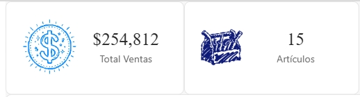

# ImageCard — Registro de cambios

Tarjeta KPI para Power BI con medida, imagen posicionable, etiqueta singular/plural,
fondo condicional por reglas y formato numérico regional determinista.

- **Idiomas del panel de formato:** English (en-US), Español (es-ES), Français (fr-FR),
  Deutsch (de-DE), Italiano (it-IT).
- **Nota de actualización:** Power BI cachea el visual importado. Para probar una
  versión nueva, elimina el visual del informe e importa el `.pbiviz` fresco.

---

## 1.0.0.45 (actual)
- Sin contenido de tooltip (sin campos en Tooltips y sin Color measure visible),
  no aparece tooltip al pasar el cursor.

## 1.0.0.44
- Tooltips con el formato del modelo (`valueFormatter` por columna + cultura del
  informe); la medida principal ya no aparece.
- `powerbi-visuals-utils-formattingutils` fijado en ^6.1.2 (la 7.0.0 rompe
  `pbiviz package`: su archivo de locales ESM no pasa el `localizationLoader`).

## 1.0.0.43
- Interruptor maestro Show image (primero en Image, activado por defecto):
  desactivado, tarjeta normal sin imagen.

## 1.0.0.42
- Medida única con reemplazo (`conditions` max:1) y lectura por rol
  (corrige la confusión con Color measure).
- Rol Tooltips múltiple (hasta 10) + tarjeta Tooltip con interruptor
  Show color measure; tooltips al pasar el cursor.

## 1.0.0.41
- `powerbi-visuals-utils-formattingmodel` 6.0.4 → ^7.1.0, sin cambios de código;
  limpieza de restos d3 de `node_modules`.

## 1.0.0.40
- Nuevo control **Card border width** (tarjeta Card, bajo Card border, rango 0–20,
  defecto **1**): el borde se dibuja solo si hay color elegido y ancho > 0.

## 1.0.0.39
- **Display Units** agrega **Percentage** (×100 + `%`, sin escalado K/M) y
  **Currency** (conserva escalado, antepone el símbolo).
- Nuevo campo **Currency symbol** (texto, defecto `$`) que **solo aparece**
  cuando se elige Currency, sin filas redundantes permanentes.

## 1.0.0.38
- Radio de borde exterior e interior por defecto en **10**.
- El borde del marco (`Card border`, 2 px) ahora nace redondeado.
- Nota: el fondo gris cuadrado más externo lo dibuja Power BI (Background nativo);
  ningún visual puede redondearlo. Para el acabado redondeado, desactiva el
  Background nativo y usa **Card background** + **Card border**.

## 1.0.0.37
- Nuevo control **Image padding** (tarjeta Image, defecto 4, rango 0–50):
  imagen a izquierda/derecha → 4 horizontal y 2 vertical;
  imagen arriba/abajo → 4 vertical y 2 horizontal.

## 1.0.0.36
- Nueva tarjeta **Card** (marco exterior + cuerpo interno):
  **Card background**, **Card border** (2 px), **Outer border radius**,
  **Inner border radius**, **Padding** (defecto 2 en todos los lados).
- El fondo KPI ahora pinta el cuerpo interno (con su propio radio).
- El auto-ajuste de letra/imagen mide el cuerpo interno.

## 1.0.0.35
- **Decimal separator** agrega la opción **Default**: usa los separadores del idioma
  del informe (`host.locale`) — es-ES/de-DE/it-IT → `1.234.567,89`,
  en-US → `1,234,567.89`, fr-FR → `1 234 567,89` — con respaldo a estilo inglés
  si el runtime no trae datos del locale.

## 1.0.0.34
- Reglas KPI con máximos por defecto 0.2 / 0.4 / 0.6 / 0.8 / 1.0
  (mínimo de Rule 1 sigue en 0; encadenado sin cambios).

## 1.0.0.33
- La tarjeta **General desaparece**: todo lo del valor numérico vive en
  **Data labels** (como los controles nativos). El objeto interno sigue llamándose
  `general` para no borrar ajustes guardados; solo cambian los textos visibles.
- Nuevo toggle **Thousands separator** (activado por defecto) en Data labels.
- Auditoría de traducciones: `Card_DataLabels` y prefijos de regla localizados
  (Règle/Regel/Regola), claves huérfanas eliminadas, DE `Tausender`.
- El formato numérico es determinista e independiente del idioma del navegador.

## 1.0.0.32
- KPI dividido en 3 tarjetas compuestas con grupos colapsables por regla:
  **KPI Color - BG** (rangos + fondo, mismo objeto `kpiBackground`, sin migración),
  **KPI Color - Labels** (objeto nuevo `kpiLabelColors`: Label + Value por regla),
  **KPI Color - Image** (objeto nuevo `kpiImageColors`).
- Lectura en cadena (objeto nuevo → `kpiBackground` legado → modelo → original):
  los colores ya configurados se conservan.

## 1.0.0.31
- Se oculta la fila **Image** del panel (`visible: false`): el control del panel no
  puede entregar bytes con propiedades `text` (mostraba `[object Object]`).
  La subida es exclusivamente pulsando la imagen/placeholder en modo edición.

## 1.0.0.30
- El panel muestra el nombre real del archivo en vez de `"imagen_subida"`.
- Los nombres sin URL se descartan para render (placeholder en diseño, nada en vista).

## 1.0.0.29
- **Placeholder** clicable (SVG inline) cuando no hay imagen en modo diseño.
- Solo se renderizan URLs cargables (`data:`/`https:`/`blob:`); respaldo `error`
  (placeholder en diseño, ocultar en vista): nunca más icono roto con texto.
- Pulsar para reemplazar **solo en modo diseño** (`ViewMode.View` lo desactiva):
  los usuarios no cambian la imagen en tableros publicados.

## 1.0.0.28
- Propiedad de imagen como **texto** (`{"text": true}`) + subclase `CustomImageUpload`
  que acepta string u objeto: es la forma que sobrevive al guardado del PBIX
  (verificado contra proyecto de referencia; los objetos `{"image": true}` se pierden
  al guardar: presentes en sesión, ausentes de `Report/Layout`).
- **Clic-para-reemplazar**: file picker oculto → `FileReader.readAsDataURL` →
  `persistProperties` con el string `data:`.
- Lector tolerante (objeto/JSON/SVG/base64/URL) + normalización `blob:` → `data:`.
- Tooltip localizado "pulsa para reemplazar".

## 1.0.0.27
- Normalización `blob:` → `data:` con reescritura vía `persistProperties`
  (una conversión por URL, sin bucles).
- Caché de sesión para updates sin `metadata.objects`.

## 1.0.0.26
- Eliminados los 15 toggles Override del KPI: color vacío = conserva el original.
- Orden de slices por grupos (rangos+fondo, luego etiqueta/valor, luego imagen).

## 1.0.0.25
- Colores por regla KPI para imagen de reemplazo, valor numérico y etiqueta.

## 1.0.0.24
- La imagen del modelo solo se restaura si está vacía (no destruye el valor persistido).

## 1.0.0.23
- Control único **Decimal separator** (Punto/Coma, alterna miles automáticamente)
  con formato manual determinista; elimina el toggle anterior.

## 1.0.0.22
- Icono del visual estilo tarjeta (números + cuadrado azul).

## 1.0.0.21
- Formato numérico con `host.locale` (separadores del informe, no del navegador).

## 1.0.0.20
- Diseño responsive: auto-reducción de letra e imagen proporcional acotada.
- Toggle de separador de miles (luego reemplazado en 1.0.0.23).

## 1.0.0.19
- Restaura la imagen desde `metadata.objects` (el servicio de formato no rellena
  `ImageUpload`).
- Ancho de imagen por defecto 60, decimales por defecto 0, nuevo icono.

## 1.0.0.18
- Correcciones: guardas de medida vacía, limpieza al vaciar datos, `displayName`
  de dropdowns, carrera asíncrona de imagen, decimales en enteros, `NaN` en hex,
  limpieza de `package.json` (se quita `d3` sin uso).
- Localización completa ES/EN/FR/DE/IT (`stringResources`, `displayNameKey`,
  `pbiviz.json` con 5 locales).

## Flujo de imagen soportado (resumen)
1. En modo edición, pulsar la imagen o el placeholder abre el selector de archivo.
2. El archivo se lee como `data:` URL y se persiste como **texto** vía
   `persistProperties` (sobrevive guardar/reabrir el PBIX).
3. Verificar con `check-pbix-image.ps1` que el Layout contenga el objeto `image`
   con esquema `data:`.
